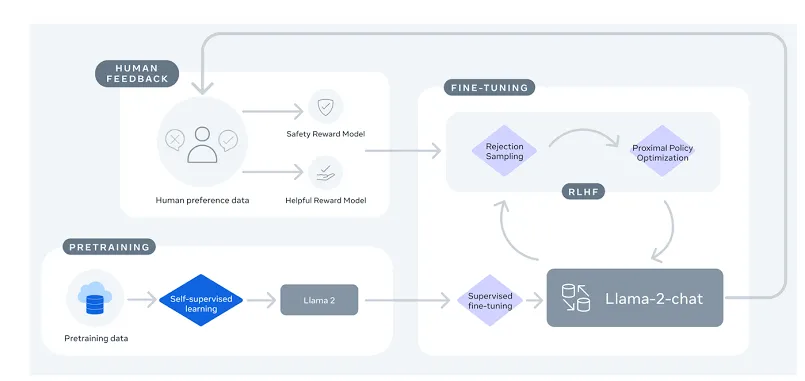

# LLM Objective

*"One limitation of the static template system is that it will still lack the level of variability likely found across a large number of clinical notes. To address this issue, we propose using existing pre-trained models (GPT-4/Llama 2) to rephrase sections of synthetic note. However, this rephrasing must still contain the original meaning and keep all of the inserted discrete feature values. These pre-trained models can be prompted to generate custom styled tuning to mimic the note-writing styles of specific medical provider or institution, ensuring that rephrasing looks consistent with how clinical notes are structured across various healthcare settings. We can work on building of control parameters that can provide the users with the ability to control the degree of rephrasing, allowing for slight or significant changes based on their preference for variability."*

# GPT-4
## Getting started
```
pip install openai
```
- WIP. Requires subscription

# Llama 2
## Overview


- Pre-trained (for NLP tasks) and fine-tuned (for chat tasks)
- Increased context length

### Local Download:
After downloading from Meta, type in the terminal:
```
pip install wget
```
Open Powershell and type to install a Linux subsystem in Windows:
```
wsl --install
wsl --set-default-version 2
```

### HuggingFace download:
In the terminal type:
```
huggingface-cli login
```
And right-click to paste log-in key from August

### Install problem (solved)
ML models commonly use Torch packages. To get llama running I had to uninstall all Torch related packages and re-install from a specific link
<br>1.)
```
py -m pip uninstall torch torchvision torchaudio
```
2.)
```
py -m pip install torch torchvision torchaudio --index-url https://download.pytorch.org/whl/cu121
```
